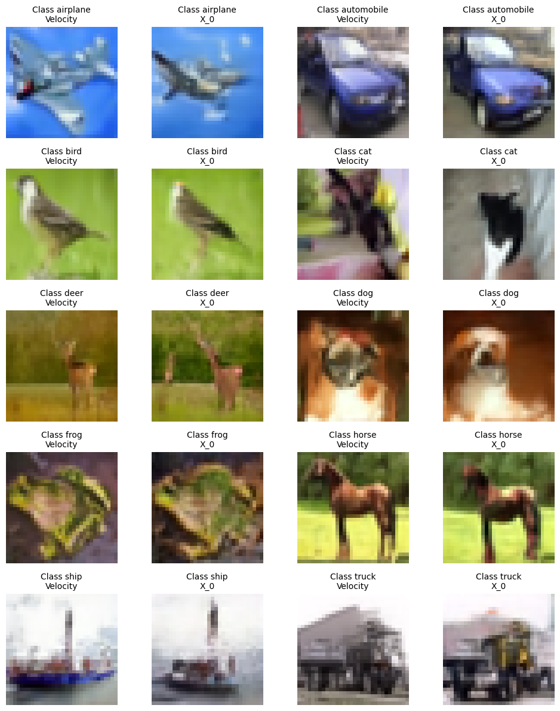
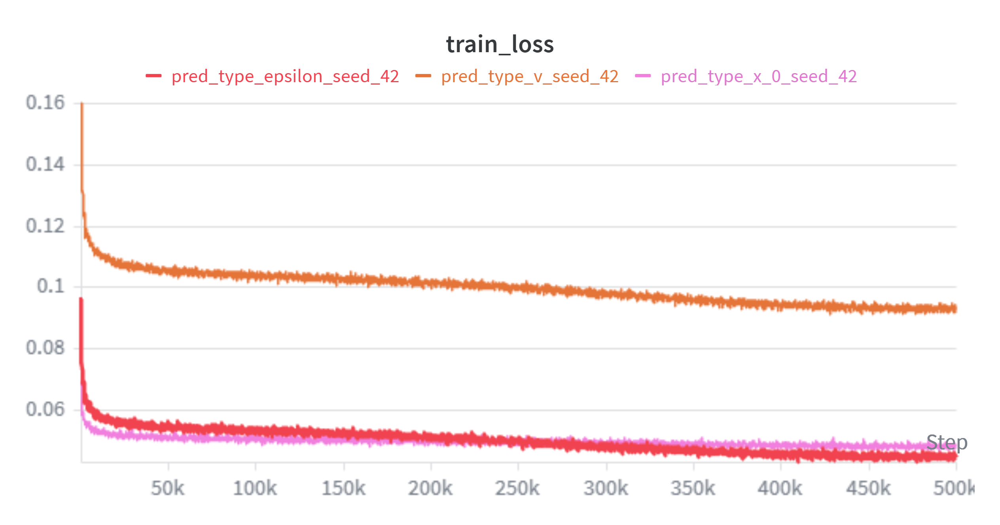
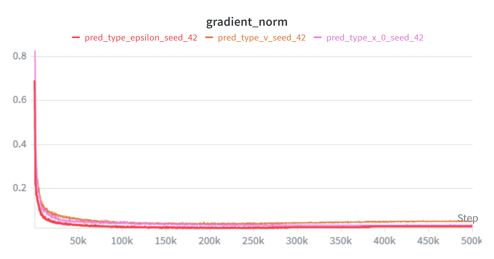
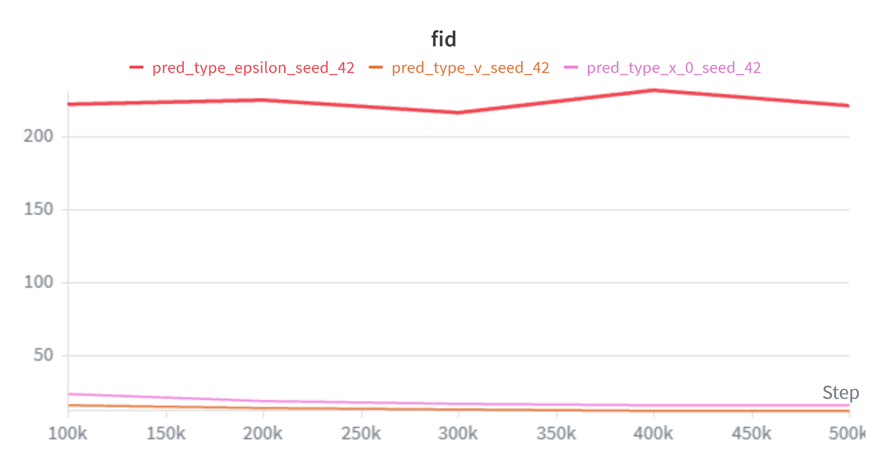
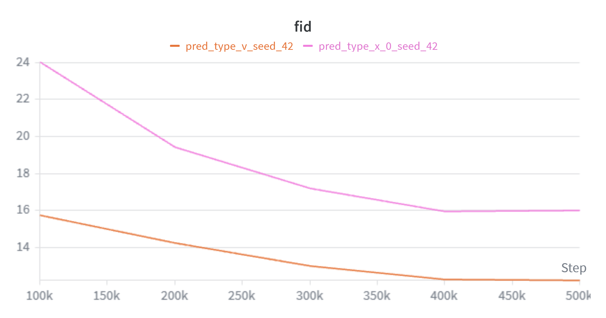

# DDPM PyTorch


<p float = 'center'>
    
</p>

A PyTorch implementation of Denoising Diffusion Probabilistic Models (DDPM) trained on CIFAR-10.
The project started as an implementation of the original DDPM paper and then became a combination of ideas from multiple diffusion works, making it suitable for experimentation and further extension. A controlled ablation study was performed to compare the training dynamics and sample quality of the three prediction targets (epsilon, x_0, v).

The model now uses the following features:
- DDPM sampling
- DDIM sampling
- Epsilon / x_0 / Velocity prediction
- Class-conditioned generation
- Classifier-Free Guidance (CFG)
- Cosine noise schedule
- Sinusoidal time embeddings
- Exponential Moving Average (EMA)
- YAML configuration
- Checkpointing and training resumption
- WandB logging
- FID evaluating
- Mix-precision training

## Installation
To download and install the repository run the following commands:
```
git clone https://github.com/RickyPyeet/ddpm-pytorch.git
cd ddpm-pytorch
pip install -r requirements.txt
```

## Training
Training is configured, and can be modified, via `configs/cifar10.yaml`. It can be performed by launching:

>`python train.py`

When training is launched CIFAR-10 is downloaded automatically.

## Sampling
When sampling, follow these steps:
1. Download one of the available checkpoints from [Hugging Face](https://huggingface.co/Pitto16/DDPM/tree/main)
2. Place the checkpoint in `checkpoints/`
3. Run the following command: `python sample.py --checkpoint checkpoints/*specific_checkpoint*.pt --sampler ddim  --labels 0 1 2 3 4 5 6 7`

To save generated samples:

```
python sample.py --checkpoint checkpoints/ddpm_small.pt --sampler ddim --labels 0 1 2 3 --save_img --save_path outputs/
```

## Ablation
How does the prediction target affect training and model stability? To investigate this question the model was trained to predict the three main targets: epsilon, x_0, and velocity.
The following parameters were kept constant:
 | Hyperparameter       | Value           | 
 |:---------------------|----------------:|
 |steps                 |500000           |
 |lr                    |3e-4             |
 |use_amp               |True             |
 |scaler_dtype          |bfloat16         |
 |schedule_type         |cosine           |
 |optim                 |adamw            |
 |ema_decay             |0.9999           |
 |class_free_dropout    |0.2              |
 |guidance_scale        |3.5              |
 |batch_size            |128              |
 |in_channels           |3                |
 |input_dim             |64               |
 |groupnorm_groups      |32               |
 |dimension_multiplier  |[1,2,4,8]        |
 |sampler               |ddim             |
 |sample_timestep       |100              |
 |eta                   |0                |

### Monitored Parameters
- Train Loss
- Gradient Norm
- FID
- Throughput
- Latency
> NOTE: Due to limited resources FID was computed using DDIM sampling and on 10k generated samples against 10k samples from CIFAR10 test set. I set  $\eta$ = 0 to make reverse process deterministic.

### Results
Although the raw losses of the three prediction targets are not directly comparable, all runs remained numerically stable. No gradient explosions or non-finite losses were observed, and both the training loss and gradient norm decreased over time. Despite this, the epsilon model failed to produce recognizable samples with the 100-step DDIM sampler. FID scores were computed every 100k steps, epsilon remained near a FID of approximately 220 while the x_0 and v models steadily improved. Under this training and evaluation setup, `v` achieved the best final FID.

`Throughput` and `Latency` were computed during the training pipeline via a validation step: 100-steps DDIM, `$\eta$ = 0`, timing was only evaluated for sampling, excluding saving times and by calling `torch.cuda.synchronize()` before each time extraction. Classifier free guidance scale was set to `3.5`.
As expected `throughput` and `latency` did not vary much with all three targets, making the results comparably the same.

>NOTE: Training and results were obtained using a NVIDIA RTX PRO 6000 Blackwell Server Edition GPU.

All results were obtained during training with the above settings (for more details check `outputs/pred_target/config.yaml`):

| Model |    FID ↓ | Throughput (images/s) ↑  | Latency (ms/image) ↓ |
| ----- | -------: | -----------------------: | -------------------: |
| ε     |    221.2 |                    19.28 |                51.86 |
| x₀    |     16.0 |                    19.30 |                51.82 |
| v     | **12.3** |                     19.3 |                51.77 |


<p float = 'left'>
    
    
    
</p>

With higher detail:
<p float = 'left'>
    
</p>

## Limitations and Improvements
- Samples made by predicting `epsilon` failed to produce recognizable samples using a DDIM sampler, that issue needs to be investigated more in depth since it's still unknown whether it's due to parameterization, training recipe or an implementation issue.
- A single run per target, without investigating other hyperparameters' values cannot quickly distinguish whether a target is better than another, a controlled sweep search should be used for a more in depth analysis on a few selected hyperparameters.
- While switching from DDPM sampling to DDIM sampling - on 100 steps - improved the generation time of `~94%`, running it on a consumer CPU still requires `~15 s` to generate one 32x32 image.
- Qualitative inspection suggests weaker fidelity for high-variance animal classes, particularly cats and dogs. To better investigate it a quantitative experiment should be designed.
- Attention is currently applied once every layer of the U-Net after the two residual blocks, its contribution to FID and runtime hasn't been isolated. Future experiments could restrict attention only to fewer layers.
- FID is currently computed on 10k images, which has a higher estimator variance than the standard 50000 samples evaluation. Final results should be validated on 50000 samples instead.


## References
- [Ho et al., Denoising Diffusion Probabilistic Models](https://arxiv.org/abs/2006.11239)
- [Song et al., Denoising Diffusion Implicit Models](https://arxiv.org/abs/2010.02502)
- [Ho & Salimans, Classifier-Free Diffusion Guidance](https://arxiv.org/abs/2207.12598)
- [Nichol & Dhariwal, Improved Denoising Diffusion Probabilistic Models](https://arxiv.org/abs/2102.09672)
- [Lai et al., The principles of Diffusion Models](https://arxiv.org/abs/2510.21890)


